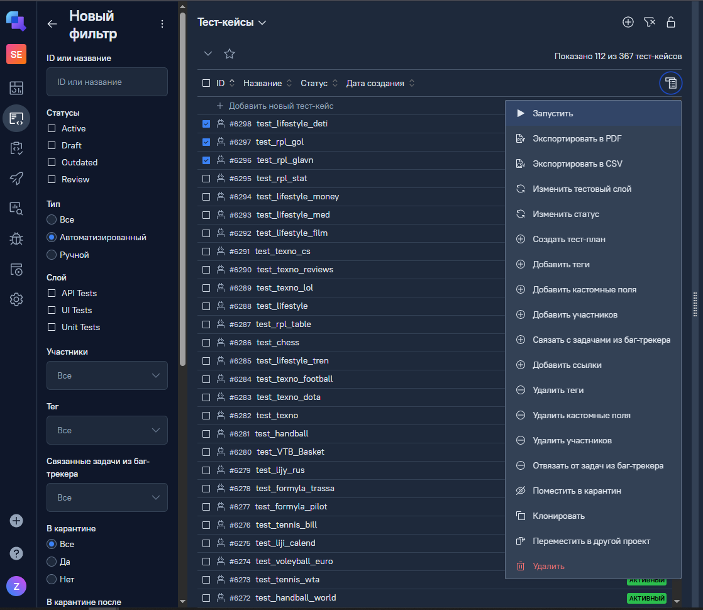
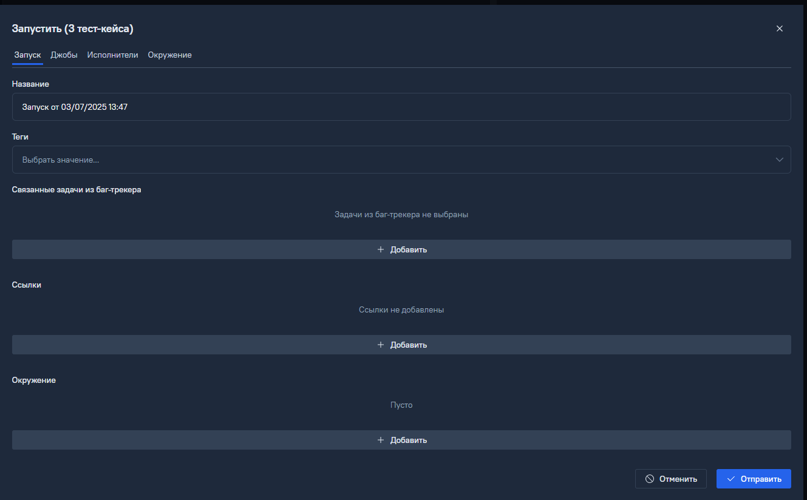

# Запуск тестов в Testops

## Для первичного запуска необходимо 
1. открыть кейсы проекта
2. Выставить фильтр на Автоматизированные кейсы. В случае необходимочти дополнительно отфильтровать кейсы
3. Выбрать галочками кейсы, которые нужно запустить
4. Нажать "Запустить"

    

    
▶️ Картинка

    

    

5. Нажать "Отправить"

    

    
▶️ Картинка

    

    

6. Джоба будет доступна по ссылке из всплывающего окна или из меню Запуски
    

    
▶️ Картинка

    

    
 